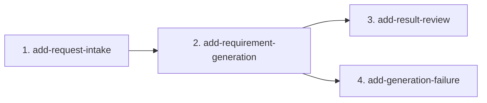

# MVP Capability Change Plan

**AI Requirements Assistant** — approved by Maryna Lakei on 2026-10-02.

Inputs: `docs/product-brief.md`, `docs/requirements.md` (signed off 2026-09-30), baseline specs under `openspec/specs/`.

## 1. Slicing principles

1. One slice is one cohesive capability, small enough to design, test, build, review, and archive as a unit.
2. Foundations first. No slice depends on a later slice.
3. Each MVP FR has one owner. Cross-cutting NFRs are honored by every slice.
4. The product is one desktop page and one server-side LLM call. Slices share that page, so they run in series.
5. Change names are `add-<capability>` under `openspec/changes/`.

The baseline has five specs. Four of them own FRs and become slices. `public-demo` owns no FR. It is a constraint every slice honors, and the first slice is where the no-login English desktop page becomes visible.

## 2. The capability changes

| # | Change name | Baseline specs touched | MVP FRs | NFRs travelled | Depends on | Parallel |
|---|---|---|---|---|---|---|
| 1 | `add-request-intake` | `request-intake`, `public-demo` | FR-1, FR-2, FR-7, FR-13 | NFR-1, NFR-2, NFR-5 | — | serialize (shared page) |
| 2 | `add-requirement-generation` | `requirement-generation` | FR-3, FR-4, FR-5, FR-9, FR-10, FR-11 | NFR-4 | 1 | serialize (shared page and LLM service) |
| 3 | `add-result-review` | `result-review` | FR-6, FR-12 | NFR-1 | 2 | serialize (shared result region) |
| 4 | `add-generation-failure` | `generation-failure` | FR-8 | NFR-3, NFR-4 | 2 | serialize (shared page) |

**Cross-cutting NFRs every change must honor:** NFR-1 English UI, NFR-2 public access with no login, NFR-5 desktop web application. TC-8 Chromium-only E2E. TC-3 no auth, database, email, or payments. BC-5 exclusions (no in-page editor, copy button, separate Regenerate control, streaming, dark theme, or persistent quota).

## 3. Dependency graph

**Critical path:** `add-request-intake` → `add-requirement-generation` → `add-result-review`. **Parallelizable:** none. Slices 3 and 4 both depend on slice 2 and both change the same page, so they stay in series: review, then failure. There is no database migration.

## 4. Per-change scope and exit criteria

### 4.1 `add-request-intake`

- **Scope in:** The desktop page, the raw-request text field (FR-1), the Generate control (FR-2), inline validation for empty or whitespace-only input with no LLM call (FR-7), and a disabled Generate control while a request is in flight (FR-13). English copy, no login, desktop layout (NFR-1, NFR-2, NFR-5).
- **Scope out:** LLM output, result sections, failure copy, character or word minimums, accounts.
- **Baseline spec impact:** Implements `request-intake`. Makes `public-demo` visible for the first time.
- **Definition of done:** A short non-empty request is accepted by validation. Empty and whitespace-only requests show an inline message and do not call the LLM. Generate disables while a request is in flight. Unit tests cover validation. A Chromium E2E covers the field, the control, and both reject cases.
- **Risks:** The in-flight disable needs a real request in later slices. This slice can prove it with a stubbed delay. No new ADR.

### 4.2 `add-requirement-generation`

- **Scope in:** One server-side LLM call (TC-2) that returns one “As a / I want / so that” User Story (FR-3, FR-9), a short Acceptance Criteria bullet list (FR-4, FR-10), and 3 to 5 gap questions (FR-5, FR-11). The call completes or fails within 30 seconds (NFR-4). The API key stays on the server.
- **Scope out:** Labeled page sections and replacement (slice 3). Failure message wording (slice 4). Vendor is chosen here as an implementation detail, not a new product requirement.
- **Baseline spec impact:** Implements `requirement-generation`.
- **Definition of done:** A non-empty request produces the three content shapes. Tests use a fake model for the shape and the timeout bound. An eval case grades that the questions are about gaps, not an exact string match. The browser bundle does not contain the API key.
- **Risks:** Provider and model choice (TC-2). Record the choice in an ADR when the slice starts. Live calls are not the unit-test path.

### 4.3 `add-result-review`

- **Scope in:** Three labeled, readable sections the BA can select with native selection (FR-6). A later success replaces the previous result (FR-12).
- **Scope out:** A copy button, an in-page editor, a separate Regenerate control (BC-5).
- **Baseline spec impact:** Implements `result-review`.
- **Definition of done:** A successful response renders three labeled sections. A second success removes the previous text. Chromium E2E and a vision pass cover the settled result.
- **Risks:** Low. Presentation only.

### 4.4 `add-generation-failure`

- **Scope in:** Provider errors and the 30-second timeout show a clear message, keep the raw request in the field, and allow another Generate (FR-8, NFR-3, NFR-4). No generic 500 page.
- **Scope out:** Empty-input validation (FR-7 stays in slice 1).
- **Baseline spec impact:** Implements `generation-failure`.
- **Definition of done:** A forced provider error and a forced timeout each show a visible message, preserve the input, and leave Generate usable. Chromium E2E covers both.
- **Risks:** The timeout test must fake a hung call. It must not depend on a live provider.

## 5. FR coverage check

| FR | Slice | FR | Slice | FR | Slice |
|---|---|---|---|---|---|
| FR-1 | 1 | FR-2 | 1 | FR-3 | 2 |
| FR-4 | 2 | FR-5 | 2 | FR-6 | 3 |
| FR-7 | 1 | FR-8 | 4 | FR-9 | 2 |
| FR-10 | 2 | FR-11 | 2 | FR-12 | 3 |
| FR-13 | 1 | | | | |

Total: **13 MVP FRs across 4 slices** (no gaps, no duplicates).

`generation-failure` names FR-7 only to exclude it. The behavior is specified in `request-intake`.

## 6. Sequencing

After this plan is approved, scaffold the Next.js app, then implement in order: intake, generation, result review, generation failure. After each archive, `npx openspec validate --all --strict` must pass before the next slice. Future-phase work (BC-2, BC-5) is not in this plan.

Application code does not start until the owner approves this plan.
